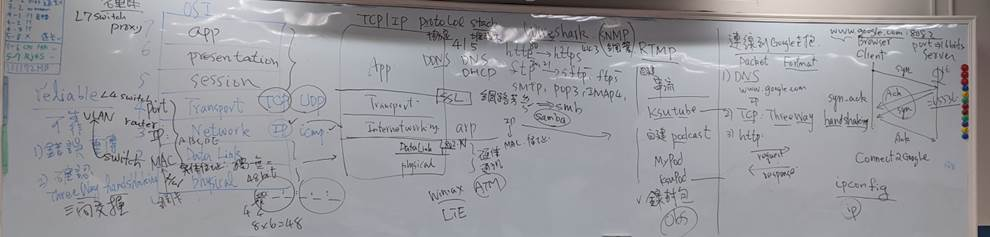

# computer netwokr計算機網路   網路概論


```
說明OSI Model與 TCP/IP protocol
```

# 協定protocol
```
何謂communcation protocol[簡稱協定protocol]?
WHY Layering為何要分層?
```


## 各種協定
```
簡述下列協定protocol
須回答
(A)英文全名
(B)運作在那一層?
(C)主要功能
(D)相關工具或伺服器
```

### application層
```
HTTP vs HTTPS
FTP vs SFTP | FTPS
TELNET vs SSH
SMTP vs POP3 INAP 4

DNS vs DNSsec

DHCP

LDAP
SAMBA

SNMP

RTMP RTSP

MQTT
```
### transport層
```
TCP 與UDP的差異
[1]須說明reliable(可靠) vs un-reliable(不可靠)
[2]如何達到reliable(可靠)
 (A)錯誤重傳
 (B) ThreeWay Handshaking
[3]封包格式 TCP format   vs UDP format 
```
### 
```
IP vs IPsec
ICMP
```
### 連結層
```
ARP
```
# 網路硬體設備 Network Devices
```
簡述底下網路設備:須說明
(A)運作在OSI那一層?
(B)主要功能


(1) HUB
(2) Switch
(3) Router
(4) L4 Switch
(5) Proxy 
```
# 各種address位址
```
PORT address
IP address
MAC address
```
